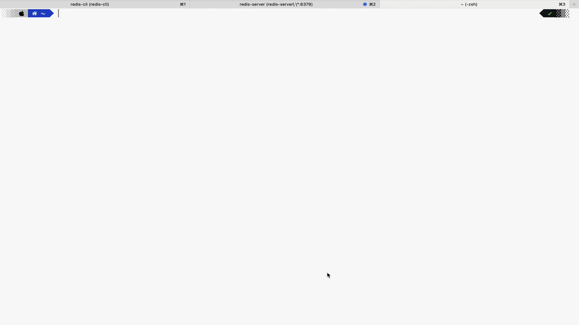
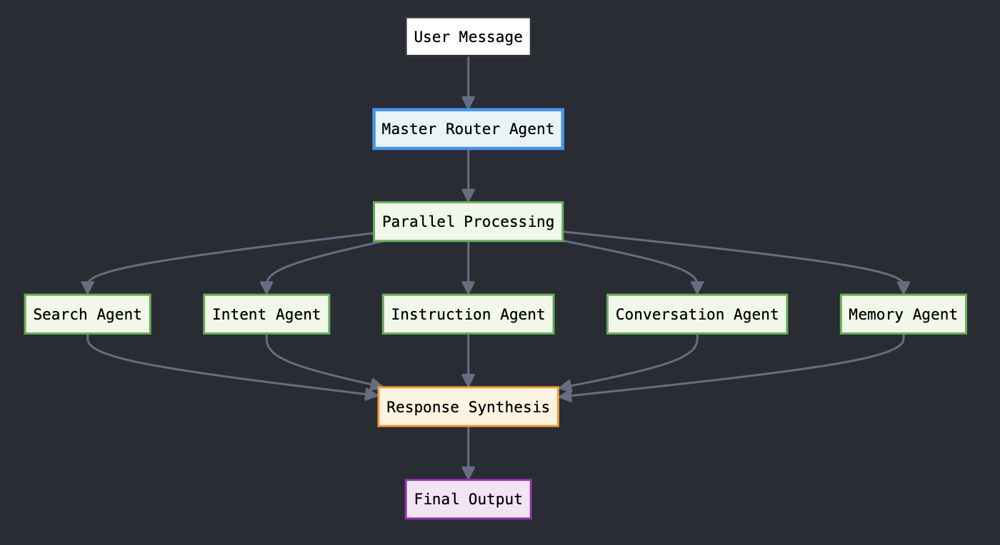

# Multi-Agent Orchestration System

## Demo



## Architecture



## Codebase

```
/src
  /agents              # Contains all agent logic
    master_router.py   # Coordinates all the agents
    search.py          # Search agent implementation
    intent.py          # Intent detection agent
    instruction.py     # Instruction-following agent
    conversation.py    # Conversation flow agent
    memory.py          # Memory agent (chat history/context)
  /api                 # API layer
    main.py            # FastAPI entrypoint
  /utils               # Utility modules
    caching.py         # Redis-based caching utilities
    circuit_breaker.py # Circuit breaker for service interruptions
  tests/               # Test suite

```

## Steps to run locally

1. Copy `.env.local` to `.env` and add the required environment variables.

2. Install dependencies (using pip or uv):
   ```sh
   pip install -r requirements.txt
   # or, if using uv:
   uv pip install -r requirements.txt
   ```

3. Run the app: `make run` or `uvicorn src.api.main:app --host 127.0.0.1 --port 6000 --reload`.

## Features

#### agents:

> master router agent
> search agent
> intent agent
> instruction agent
> conversation agent
> memory agent

#### toppings:

- parallel execution
- worker threads for agent isolation
- caching for performance optimization
- circuit breakers for failure handling

## Tweet

https://twitter.com/ajeetunc/status/1939904295044010472
